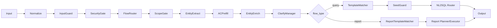
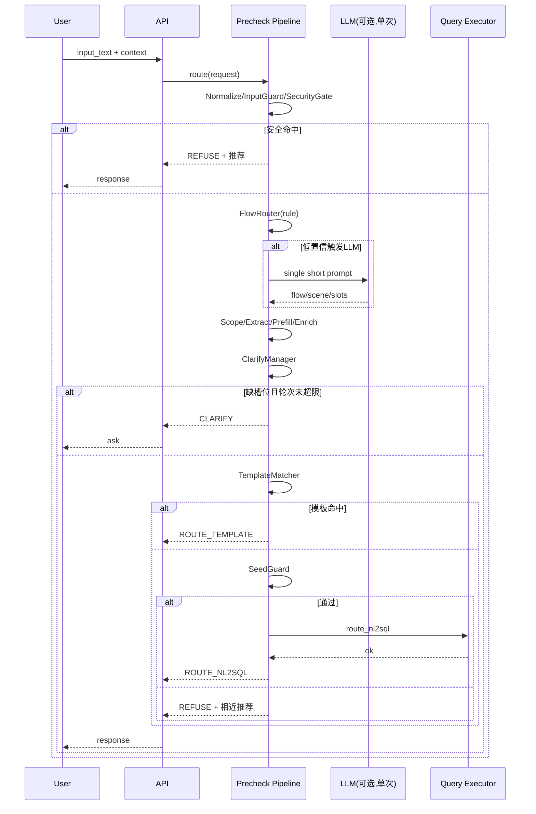
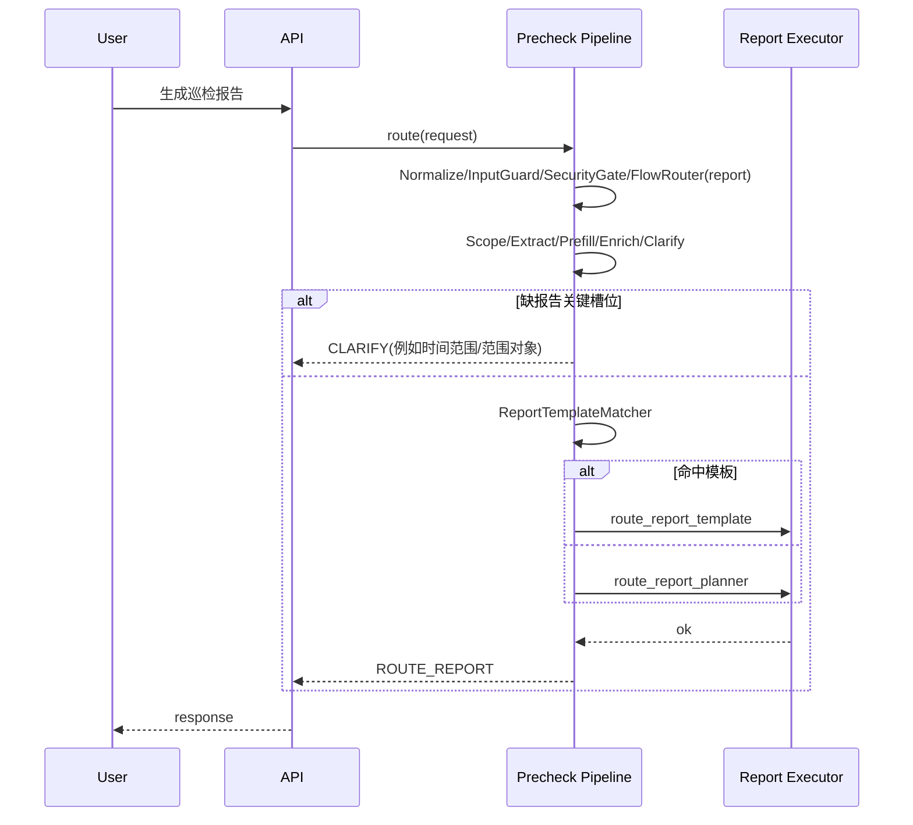

# 对话式前置处理 V1 设计方案

## 1. 文档目标
本方案用于指导 `chat_pre_check` 的 V1 继续演进，重点解决以下目标：

1. 在不牺牲可维护性的前提下，提升真实落地效果。
2. 统一承载多业务流（当前：智能问数、智能报告；后续可扩展）。
3. 保持洋葱架构与中间件流水线模式，不引入复杂分叉实现。
4. 引入 LLM 单次增强能力，但严格约束调用次数、耗时和 prompt 长度。

## 2. 设计原则

1. 简单优先：能用配置表达的，不引入新框架。
2. 效果优先：安全拒答、分流准确、追问有效是主目标。
3. 稳定优先：规则与检索主导，LLM 仅做单次增强。
4. 可观测优先：每个关键决策都进入 trace。
5. 兼容扩展：新增业务流通过配置接入，不改主链路。

## 3. 现状与改造边界

当前系统已具备：

1. 中间件流水线与可插拔能力。
2. 安全/权限拒答能力。
3. 场景范围判断、模板匹配、SeedGuard、NL2SQL 兜底。
4. 缺槽位追问与推荐选项。

V1 重点新增：

1. 业务流分流层（query/report/direct/unknown）。
2. LLM 单次增强器（仅在不确定时触发）。
3. 上下文多轮控制字段（3-5 轮追问上限）。
4. 推荐策略加入“相似度 + 热度”混合排序。

不在 V1 范围：

1. 多次 LLM 链式推理。
2. 复杂工作流编排系统。
3. 重型记忆库或长期会话数据库重构。

## 4. 总体架构（保持洋葱模式）

洋葱分层不变：

1. `domain`: 模型、枚举、接口协议。
2. `application`: 中间件编排、决策策略、追问与推荐。
3. `infrastructure`: ES/OS 客户端、AC 预提参、配置加载。
4. `interfaces`: API/CLI 接入。

主流程（V1）：



## 5. 中间件顺序（洋葱流水线）

V1 推荐顺序：

1. `NormalizeMiddleware`
2. `InputGuardMiddleware`
3. `SecurityGateMiddleware`（可复用现有 `PolicyGuardMiddleware` 扩展）
4. `FlowRouterMiddleware`（新增）
5. `ScopeGateMiddleware`（按 flow 做边界判定）
6. `EntityExtractorMiddleware`
7. `ParamPrefillMiddleware`
8. `EntityEnricherMiddleware`
9. `ClarifyManagerMiddleware`（可由 `SlotClarifierMiddleware` 扩展）
10. `TemplateMatcherMiddleware` 或 `ReportTemplateMatcherMiddleware`
11. `SeedScopeGuardMiddleware`（仅 query 生效）
12. `NL2SQLRouterMiddleware` 或 `ReportExecutorMiddleware`

说明：

1. 安全类拒答放在前置，保证“立即拒答”。
2. 分流在 scope 前，避免 query/report 混淆竞争。
3. SeedGuard 仅对 query->NL2SQL 兜底路径生效。

## 6. 业务流模型（Flow）

统一定义：

1. `query`: 智能问数（告警、KPI、分析查询）。
2. `report`: 智能报告（巡检报告、周期报告）。
3. `direct`: 指令直通（运维固定入口、健康检查等）。
4. `unknown`: 无法分流，直接拒答并推荐。

FlowRouter 判定优先级：

1. 显式 `route_override`（上下文直通）。
2. 规则命中（关键词/意图模板）。
3. 向量召回分数。
4. 触发一次 LLM 增强（仅低置信时）。

## 7. LLM 单次增强设计

### 7.1 触发条件

触发任一条件才调用：

1. flow top1 置信度低于阈值（如 `< 0.62`）。
2. flow top1 与 top2 gap 过小（如 `< 0.08`）。
3. 缺关键槽位且候选质量不足。

### 7.2 调用约束

1. 每请求最多调用 1 次。
2. `timeout_ms`: 建议 500-800ms。
3. prompt 长度受限，禁止注入长历史上下文。
4. LLM 失败/超时自动降级为规则链路。

### 7.3 输入输出规范

输入（最小集合）：

1. `input_text`
2. `flow_candidates(top2)`
3. `scene_candidates(top3)`
4. `extracted_slots`

输出（严格 JSON）：

```json
{
  "flow_type": "query|report|direct|unknown",
  "scene": "alarm.query",
  "slots": {"time_range": "today"},
  "need_clarify": ["object_scope"],
  "confidence": 0.86
}
```

## 8. 配置草案（段级）

### 8.1 capabilities 新增字段

```json
{
  "capability_id": "alarm.query",
  "flow_type": "query",
  "router_priority": 90,
  "entry_phrases": ["查告警", "查今天告警", "查KPI"],
  "clarify": {
    "enabled": true,
    "max_rounds": 5,
    "ask_slots_per_round": 2
  },
  "llm_assist": {
    "enabled": true,
    "trigger_on_ambiguous": true,
    "trigger_on_missing_key_slots": true
  },
  "execution": {
    "preferred_route": "template_first",
    "fallback_route": "nl2sql"
  }
}
```

报告类示例：

```json
{
  "capability_id": "report.inspect",
  "flow_type": "report",
  "router_priority": 85,
  "entry_phrases": ["生成巡检报告", "帮我生成报告"],
  "clarify": {
    "enabled": true,
    "max_rounds": 3,
    "ask_slots_per_round": 2
  },
  "execution": {
    "preferred_route": "report_template_first",
    "fallback_route": "report_planner"
  },
  "report_policy": {
    "required_slots": ["time_range", "report_scope"],
    "default_template_id": "tpl_report_inspection_daily"
  }
}
```

### 8.2 rules 新增字段

```json
{
  "security_gate": {
    "immediate_refuse_keywords": ["越权", "注入", "破解"],
    "permission_rules": [
      {"roles": ["guest"], "keywords": ["敏感报告", "财务报告"]}
    ]
  },
  "flow_router": {
    "enabled": true,
    "min_confidence": 0.62,
    "ambiguous_gap": 0.08,
    "allow_direct_pass": true,
    "direct_pass_intents": ["health.check", "help"]
  },
  "llm": {
    "enabled": true,
    "max_calls_per_request": 1,
    "timeout_ms": 700,
    "max_input_chars": 350,
    "max_output_tokens": 120,
    "prompt_template_id": "precheck_v1_short_json",
    "fallback_on_timeout": "rule_only"
  },
  "clarify": {
    "global_max_rounds": 5,
    "round_key": "clarify_round",
    "pending_slots_key": "pending_slots",
    "on_exceed_max_rounds": "refuse_with_recommendation"
  },
  "recommendation": {
    "enable_hot_queries": true,
    "hot_query_window_days": 7,
    "topk": 4,
    "score_mix": {"similarity": 0.6, "hotness": 0.4}
  }
}
```

## 9. 上下文设计（轻量、可回传）

V1 建议上下文字段：

```json
{
  "session_id": "s_001",
  "flow_type": "query",
  "scene": "alarm.query",
  "slots": {"time_range": "today"},
  "pending_slots": ["object_scope"],
  "clarify_round": 1,
  "max_clarify_round": 5,
  "last_decision_type": "clarify",
  "route_override": null
}
```

规则：

1. 服务端每轮 merge `context.slots` 与当前抽取结果。
2. `clarify_round` 每次返回 `clarify` 时自增。
3. 达到 `max_clarify_round` 立即停止追问，返回拒答+推荐。
4. `route_override` 仅白名单能力可用。

## 10. 时序图

### 10.1 Query 流程



### 10.2 Report 流程



## 11. 决策表与伪代码

### 11.1 决策表

| 条件 | 动作 | 输出 |
|---|---|---|
| 命中安全/权限规则 | 立即拒答 + 推荐 | `refuse(policy/permission)` |
| flow 不确定且满足触发条件 | 调用一次 LLM | 更新 `flow/scene/slots` |
| flow 仍未知 | 拒答 + 相近能力推荐 | `refuse(unsupported)` |
| 超能力边界 | 拒答 + 相似场景推荐 | `refuse(out_of_scope)` |
| 缺槽位且轮次未超限 | 追问 | `clarify` |
| 缺槽位且轮次超限 | 停止追问并拒答 | `refuse(clarify_exceeded)` |
| query 模板命中 | 路由模板执行 | `route_template` |
| query 模板未命中 + SeedGuard 通过 | 路由 NL2SQL | `route_nl2sql` |
| report 模板命中 | 路由报告模板 | `route_report_template` |
| report 模板未命中 | 报告规划器兜底 | `route_report` |

### 11.2 伪代码

```text
function route(request):
  ctx = merge_context(request)

  run Normalize, InputGuard
  if SecurityGate.hit(ctx):
    return refuse(policy_recommendation)

  flow = FlowRouter.rule_first(ctx)
  if flow.ambiguous and LLM.enabled and ctx.llm_calls < 1:
    flow = FlowRouter.llm_once(ctx) or flow

  if flow.unknown:
    return refuse(similar_capability_recommendation)

  run ScopeGate(flow), EntityExtract, ACPrefill, EntityEnrich

  if has_missing_slots(ctx):
    if ctx.clarify_round < ctx.max_clarify_round:
      return clarify(next_slots)
    return refuse(clarify_exceeded_recommendation)

  if flow.type == "query":
    if TemplateMatcher.hit(ctx):
      return route_template(ctx)
    if SeedGuard.pass(ctx):
      return route_nl2sql(ctx)
    return refuse(seed_scope_recommendation)

  if flow.type == "report":
    if ReportTemplateMatcher.hit(ctx):
      return route_report_template(ctx)
    return route_report_planner(ctx)

  if flow.type == "direct":
    return route_direct(ctx)

  return refuse(fallback_recommendation)
```

## 12. 推荐策略（V1）

推荐项最终分数：

1. `score = 0.6 * similarity + 0.4 * hotness`

数据来源：

1. 相似度：场景/模板/seed 命中分。
2. 热度：近 7 天匿名聚合（按意图或模板统计）。

拒答时推荐原则：

1. 同 flow 优先。
2. 同 scene 次优。
3. 跨 flow 仅保留 1 个兜底建议（如“我能查什么”）。

## 13. 性能目标（V1）

1. 无 LLM 调用：`p95 < 200ms`。
2. 有 LLM 调用：`p95 < 900ms`。
3. 每请求 LLM 调用数：`<= 1`。
4. LLM 超时降级成功率：`100%`（不影响主流程可用性）。

## 14. 落地步骤（建议）

1. 第一步：仅加 `flow_type` 与 `FlowRouter`（LLM 开关关闭）。
2. 第二步：扩展上下文字段与 3-5 轮追问上限。
3. 第三步：接入 LLM 单次增强（默认灰度）。
4. 第四步：引入“相似度+热度”推荐融合。

每一步都要求：

1. 单测覆盖新增决策分支。
2. acceptance 用例覆盖 query/report/拒答/追问。
3. benchmark 新增稳定性和分流准确率指标。

## 15. 风险与回退

主要风险：

1. flow 分流误判导致错误执行链路。
2. LLM 偶发延迟影响请求时延。
3. 多轮追问状态不一致导致体验抖动。

回退策略：

1. `rules.llm.enabled=false` 可立即关闭 LLM 增强。
2. `flow_router.enabled=false` 回退现有 scene 直判方式。
3. 超时与异常统一降级到规则链路。

